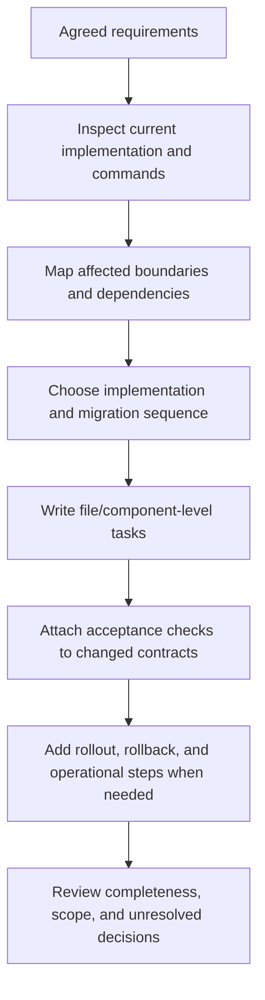

# Write Implementation Plans

Write an implementation-ready plan for an agreed change: exact current-state
evidence, files/components, ordered work, dependencies, interfaces, data and
migration effects, verification, rollout/rollback, and completion conditions. A
plan guides work; it does not perform or claim it.

## Operating contract

- Start from agreed requirements and inspect the actual repository. Do not plan
  files, symbols, APIs, commands, or architecture from memory.
- Do not invent product behavior, owners, estimates, support obligations,
  approval stages, documents, services, or cleanup work.
- Use the repository’s established planning format and level of detail. A small
  change needs a small plan; a cross-boundary migration needs explicit
  sequencing and recovery.
- Resolve routine implementation choices from code and conventions. Surface only
  material external/product/contract decisions.
- Each task must have a concrete change, prerequisites, outputs, and acceptance
  evidence. “Implement feature” is not an executable step.

## Workflow

## Procedure

1. Confirm the plan’s outcome, in/out of scope, requirements authority, target
   repository/revision, and expected deliverable. Use an existing
   issue/spec/design decision rather than restating it unless necessary for
   execution.
1. Inspect source, interfaces, call sites, schemas, generated/source
   relationships, tests, build/release commands, ownership, deployment, and
   prior migrations. Record the current state and exact locations that drive the
   plan.
1. Identify affected contract boundaries and dependencies: producer/consumer,
   client/server, data reader/writer, API/SDK, runtime/build, plugin/host,
   security, and operational state.
1. Choose an implementation strategy consistent with accepted architecture and
   project conventions. For unresolved technical uncertainty, plan a bounded
   experiment with a decision criterion; do not silently choose an external
   behavior.
1. Write dependency-ordered tasks at file/component granularity. Each states the
   change, purpose, prerequisites, interaction with existing code, edge/failure
   behavior, and acceptance check. Mark parallelizable work only when ownership
   and outputs do not conflict.
1. Add data/schema/config/package migrations, compatibility, coexistence,
   rollout, observability, rollback, cleanup, documentation, and release work
   only when the change actually crosses those boundaries.
1. Map verification to each changed contract and specify exact existing commands
   or needed tests. Separate static, unit, integration, host/device, migration,
   packaging, deployment, and production evidence.
1. Review for omitted consumers, one-sided protocol changes, invented scope,
   wrong source-of-truth edits, irreversible steps, unbounded work, and
   completion claims. Deliver the plan without executing it.

## Read only the material needed

| Situation | Read or use |
| --- | --- |
| Planning maintenance and codebase changes | [Maintenance planning](references/maintenance-and-change-planning.md) |
| Choosing process/detail proportionate to risk | [Process selection](references/process-selection.md) |
| Handling estimates and risk without fabricated precision | [Estimation and risk](references/estimation-and-risk.md) |
| Choosing task decomposition and dependency order | [Decision guide](references/decision-guide.md) |
| Using complete API, data, plugin, and rollout plan examples | [Worked examples](references/worked-examples.md) |
| Mapping plan completion to evidence | [Verification and evidence](references/verification-and-evidence.md) |
| Avoiding invented services, stages, and generic cleanup | [Failure modes](references/failure-modes.md) |
| Using the change-plan example | [Change plan example](assets/change-plan-example.md) |
| Checking planning and engineering sources | [Source index](references/source-index.md) |

## Additional specialized references

Read only the reference whose subject affects the current task.

| Reference | Use when |
| --- | --- |
| [Domain model and authority](references/domain-model.md) | Current implementation is evidence of state, not automatically the desired contract. |
| [Enterprise operation and governance](references/enterprise-operation.md) | The skill may be used in repositories with protected branches, regulated data, separate owning teams, long support windows, and reproducible-build or audit requirements. |
| [Bundled resource catalog](references/resource-catalog.md) | Use this catalog to locate the exact skill-local files needed for the task. |

## Evaluation cases

Use [evaluation cases](references/evaluation-cases.md) for realistic activation,
near-miss, and instruction-conformance probes. These are maintained test inputs,
not claimed results.

## Bundled executable helpers

- No bundled script is mandatory. Use the target repository’s established tools.

Run a helper only for the contract it documents. Inspect arguments and output; a
zero exit status proves only the checks implemented by that helper.

## Bundled output material

- `assets/change-plan-example.md`

Copy or adapt assets into the target workspace. Do not edit the installed skill
as a substitute for changing the requested repository.

## Completion evidence

- Agreed outcome, scope, requirements source, and inspected current state.
- Affected boundaries, components/files, consumers, and dependencies.
- Ordered implementation tasks with prerequisites and parallelism constraints.
- Migration/rollout/rollback/cleanup only where required.
- Exact acceptance and verification path for every changed contract.
- Unresolved user-owned decisions and bounded experiments for technical
  unknowns.

## Stop or escalate

- Requirements or a material external behavior remain unresolved.
- The repository/current system has not been inspected enough to name real
  components and commands.
- The requested task is routine and does not warrant a persistent plan; provide
  only the requested concise result.
- The request is to review or execute an existing plan rather than write one.

Do not claim completion while a required check is failed, unattempted, or
unavailable. State the exact evidence and the remaining boundary instead of
promoting a narrower result into a broader claim.
