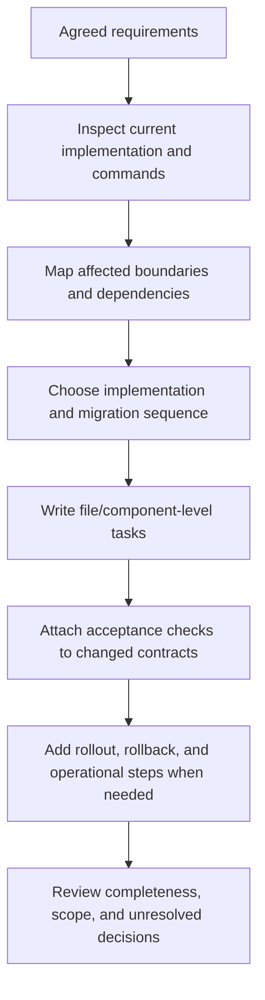

# Write Implementation Plans

Write an implementation-ready plan for an agreed change: exact current-state
evidence, files/components, ordered work, dependencies, interfaces, data and
migration effects, verification, rollout/rollback, and completion conditions. A
plan guides work; it does not perform or claim it.

## Operating contract

- Start from agreed requirements and inspect the actual repository. Do not plan
  files, symbols, APIs, commands, or architecture from memory.
- Do not invent product behavior, owners, estimates, support obligations,
  approval stages, documents, services, or cleanup work.
- Use the repository's established planning format and level of detail. A small
  change needs a small plan; a cross-boundary migration needs explicit
  sequencing and recovery.
- Resolve routine implementation choices from code and conventions. Surface only
  material external/product/contract decisions.
- Each task must have a concrete change, prerequisites, outputs, and acceptance
  evidence. “Implement feature” is not an executable step.

## Implementation-planning contract

- Treat the user goal, scope, approval boundary, and required evidence as
  controlling. This skill narrows how to produce a implementation plan; it MUST
  NOT broaden authority or override repository instructions.
- For GPT-5.6 and GPT-6, provide agreed requirements, current repository,
  dependencies, migrations, rollout constraints, and acceptance boundary, hard
  constraints, available tools, and the finish condition once. Remove repeated
  directions and examples unless a recorded evaluation shows that they prevent a
  real failure.
- Infer routine, reversible steps from inspected evidence. Ask only when an
  unresolved choice changes an external contract. Stop before an external write,
  destructive action, credential use, or material scope expansion that the user
  did not authorize.
- Load a linked reference only when its subject affects the current decision.
  Use scripts for deterministic mechanics; use model judgment for semantic
  decisions. Inspect tool output before relying on it.
- Validate at the boundary of the claim with path validation, dependency
  ordering, migration rehearsal, and acceptance-test traceability. Report
  commands, observed results, and gaps. A parser, build, or single green test
  proves only the property that it can discriminate.
- Use **MUST** only for an absolute safety or interoperability requirement,
  **SHOULD** for a default with valid exceptions, and **MAY** for an option.
  Write short active sentences and use one stable term for each concept. This
  style is STE-inspired; it is not a claim of formal ASD-STE100 conformance.

## Workflow

## Procedure

1. Confirm the plan's outcome, in/out of scope, requirements authority, target
   repository/revision, and expected deliverable. Use an existing
   issue/spec/design decision rather than restating it unless necessary for
   execution.
1. Inspect source, interfaces, call sites, schemas, generated/source
   relationships, tests, build/release commands, ownership, deployment, and
   prior migrations. Record the current state and exact locations that drive the
   plan.
1. Identify affected contract boundaries and dependencies: producer/consumer,
   client/server, data reader/writer, API/SDK, runtime/build, plugin/host,
   security, and operational state.
1. Choose an implementation strategy consistent with accepted architecture and
   project conventions. For unresolved technical uncertainty, plan a bounded
   experiment with a decision criterion; do not silently choose an external
   behavior.
1. Write dependency-ordered tasks at file/component granularity. Each states the
   change, purpose, prerequisites, interaction with existing code, edge/failure
   behavior, and acceptance check. Mark parallelizable work only when ownership
   and outputs do not conflict.
1. Add data/schema/config/package migrations, compatibility, coexistence,
   rollout, observability, rollback, cleanup, documentation, and release work
   only when the change actually crosses those boundaries.
1. Map verification to each changed contract and specify exact existing commands
   or needed tests. Separate static, unit, integration, host/device, migration,
   packaging, deployment, and production evidence.
1. Review for omitted consumers, one-sided protocol changes, invented scope,
   wrong source-of-truth edits, irreversible steps, unbounded work, and
   completion claims. Deliver the plan without executing it.

## Choose the planning-evidence reference

| Situation | Read or use |
| --- | --- |
| Planning maintenance and codebase changes | [Maintenance planning](references/maintenance-and-change-planning.md) |
| Choosing process/detail proportionate to risk | [Process selection](references/process-selection.md) |
| Handling estimates and risk without fabricated precision | [Estimation and risk](references/estimation-and-risk.md) |
| Choosing task decomposition and dependency order | [Operational decisions](references/implementation-planning-operational-decisions.md) |
| Using complete API, data, plugin, and rollout plan examples | [Worked scenarios](references/implementation-planning-worked-scenarios.md) |
| Mapping plan completion to evidence | [Verification and claim evidence](references/implementation-planning-verification-and-claim-evidence.md) |
| Avoiding invented services, stages, and generic cleanup | [Failure patterns and recovery](references/implementation-planning-failure-patterns-and-recovery.md) |
| Using the change-plan example | [Change plan example](assets/change-plan-example.md) |
| Checking planning and engineering sources | [Standards, APIs, and authorities](references/implementation-planning-standards-apis-and-authorities.md) |

## Planning decision references

Read only the reference whose subject affects the current task.

| Reference | Use when |
| --- | --- |
| [Concepts, contracts, and invariants](references/implementation-planning-concepts-contracts-and-invariants.md) | Use when distinguishing the requested implementation plan from observed repository state. |
| [Enterprise operation and governance](references/implementation-planning-organizational-controls-and-scale.md) | Use when the implementation plan crosses ownership, data-handling, release, or audit boundaries. |
| [Bundled resource map](references/implementation-planning-bundled-resource-map.md) | Use when locating bundled resources for the implementation plan. |

## Behavioral evaluation

Run [the maintained Agent Skills evaluations](evals/evals.json) in clean
target-client contexts. Compare this revision with a no-skill or prior-skill
baseline. Review commands, diffs, and artifacts; do not grade prose alone. The
checked-in cases are test inputs, not claimed results.

## Bundled executable helpers

- No bundled script is mandatory. Use the target repository's established tools.

Run a helper only for the contract it documents. Inspect arguments and output; a
zero exit status proves only the checks implemented by that helper.

## Bundled output material

- `assets/change-plan-example.md`

Copy or adapt assets into the target workspace. Do not edit the installed skill
as a substitute for changing the requested repository.

## Completion evidence

- Agreed outcome, scope, requirements source, and inspected current state.
- Affected boundaries, components/files, consumers, and dependencies.
- Ordered implementation tasks with prerequisites and parallelism constraints.
- Migration/rollout/rollback/cleanup only where required.
- Exact acceptance and verification path for every changed contract.
- Unresolved user-owned decisions and bounded experiments for technical
  unknowns.

## Stop or escalate

- Requirements or a material external behavior remain unresolved.
- The repository/current system has not been inspected enough to name real
  components and commands.
- The requested task is routine and does not warrant a persistent plan; provide
  only the requested concise result.
- The request is to review or execute an existing plan rather than write one.

Do not claim completion while a required check is failed, unattempted, or
unavailable. State the exact evidence and the remaining boundary instead of
promoting a narrower result into a broader claim.
