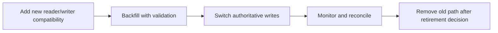

# Worked implementation-plan examples

## Good task shape

```markdown
### 3. Publish cancellation state through the API

Prerequisites: task 1 adds the persisted state; task 2 updates the worker.

Change:
- Update `src/api/export_handler.*` to map persisted cancellation to the public
  response and preserve existing not-found/authorization errors.
- Update the generated schema source, then regenerate the checked-in client.

Acceptance:
- API integration test observes cancelled state for an authorized owner.
- Unauthorized and unknown job behavior remains unchanged.
- Regeneration produces no unexplained diff.
```

## Data migration sequence



Do not include this sequence for a local field rename with no persisted/external
state.

## Invalid plan step

> Refactor the architecture and add caching for scalability.

It lacks requirement, target, measurements, ownership, invalidation, bounds,
verification, and necessity. Remove it unless the agreed change establishes
those needs.
