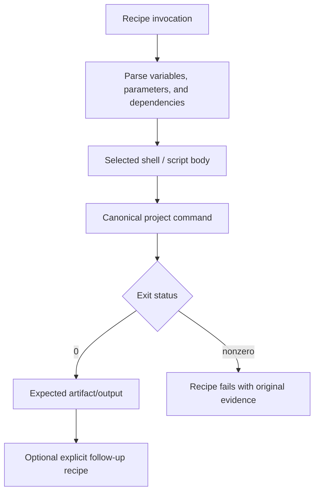

# Write Justfiles

Expose existing project operations through valid, predictable `just` recipes
without duplicating build logic, masking exit codes, changing shell semantics,
or making platform/tool assumptions that the project does not support.

## Operating contract

- Inspect the installed `just` version, existing justfiles/imports/modules,
  shell configuration, project commands, and invocation working directory.
- A justfile is orchestration, not a second build system. Call canonical
  scripts/tools instead of copying their implementation into recipes.
- Preserve command exit status and meaningful stderr. Do not append successful
  commands after failures, use `|| true`, or hide unsupported checks.
- Quote parameters according to `just` interpolation and the selected shell; do
  not concatenate untrusted values into evaluated shell code.
- Avoid implicit platform assumptions. Use project-supported shell/OS mechanisms
  and explicit recipe attributes only for the installed version.

## Workflow

## Procedure

1. Inspect current justfiles, imports/modules, default recipe, variables,
   settings, aliases, parameter syntax, shell selection, and project
   scripts/build tools. Check the installed `just --version`.
1. Define the requested recipe contract: name, parameters, defaults,
   prerequisites, working directory, environment, output/artifact, side effects,
   and exit behavior. Avoid names that collide or hide different commands.
1. Reuse canonical commands. Use dependencies only for true prerequisite
   ordering; avoid phony dependency webs that rerun expensive or stateful
   actions unexpectedly.
1. Implement with native just syntax supported by the installed version. Prefer
   script recipes or argument arrays where quoting is fragile. Use `set
   dotenv-load`, positional args, variadics, OS selectors, and functions only
   when the project requires them.
1. Validate parsing and listing. Exercise normal, boundary, invalid,
   quoted-space, missing-tool, and underlying-command failure cases. Verify the
   recipe returns the underlying failure and runs from the intended directory.
1. Inspect `just --dump`/`--list` or equivalent and final diff. Ensure no
   secrets, local absolute paths, temporary artifacts, duplicate build logic, or
   unsupported shell assumptions were added.
1. Document only non-obvious parameters/side effects in the existing project
   docs or comments. Do not create a new task framework around one recipe.

## Read only the material needed

| Situation | Read or use |
| --- | --- |
| Checking current syntax, settings, functions, and recipe behavior | [Current just API](references/current-just-api.md) |
| Choosing recipes, dependencies, shell, and parameters | [Decision guide](references/decision-guide.md) |
| Using complete quoting, OS, dependency, and failure examples | [Worked examples](references/worked-examples.md) |
| Verifying parse, invocation, outputs, and exit propagation | [Verification and evidence](references/verification-and-evidence.md) |
| Avoiding duplicated build logic and masked failures | [Failure modes](references/failure-modes.md) |
| Using the example justfile | [Example justfile](assets/example.just) |
| Running the local checker | [Justfile checker](scripts/check_justfiles.py) |
| Checking current official manual | [Source index](references/source-index.md) |

## Additional specialized references

Read only the reference whose subject affects the current task.

| Reference | Use when |
| --- | --- |
| [Domain model and authority](references/domain-model.md) | Current implementation is evidence of state, not automatically the desired contract. |
| [Enterprise operation and governance](references/enterprise-operation.md) | The skill may be used in repositories with protected branches, regulated data, separate owning teams, long support windows, and reproducible-build or audit requirements. |
| [Bundled resource catalog](references/resource-catalog.md) | Use this catalog to locate the exact skill-local files needed for the task. |

## Evaluation cases

Use [evaluation cases](references/evaluation-cases.md) for realistic activation,
near-miss, and instruction-conformance probes. These are maintained test inputs,
not claimed results.

## Bundled executable helpers

- `scripts/check_justfiles.py --help`
- `scripts/test_check_justfiles.py`

Run a helper only for the contract it documents. Inspect arguments and output; a
zero exit status proves only the checks implemented by that helper.

## Bundled output material

- `assets/example.just`

Copy or adapt assets into the target workspace. Do not edit the installed skill
as a substitute for changing the requested repository.

## Completion evidence

- Recipe contract and installed just/shell context.
- Minimal justfile changes that call canonical project commands.
- Parse/list output and representative successful/failing invocations.
- Correct parameters, quoting, dependencies, working directory, and exit
  behavior.
- No unrelated build-tool or repository-config replacement.

## Stop or escalate

- The requested operation does not have a canonical underlying command or its
  behavior is unresolved.
- The installed `just` version cannot support the requested syntax and upgrading
  is not authorized.
- A recipe would expose secrets or require unsafe evaluation of untrusted input.
- The request is to change the build system rather than add orchestration.

Do not claim completion while a required check is failed, unattempted, or
unavailable. State the exact evidence and the remaining boundary instead of
promoting a narrower result into a broader claim.
