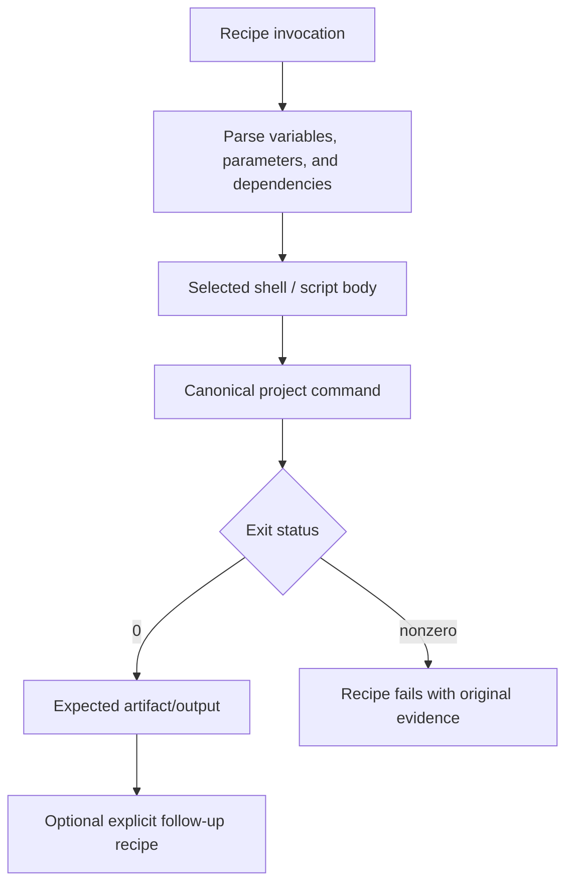

# Write Justfiles

Expose existing project operations through valid, predictable `just` recipes
without duplicating build logic, masking exit codes, changing shell semantics,
or making platform/tool assumptions that the project does not support.

## Operating contract

- Inspect the installed `just` version, existing justfiles/imports/modules,
  shell configuration, project commands, and invocation working directory.
- A justfile is orchestration, not a second build system. Call canonical
  scripts/tools instead of copying their implementation into recipes.
- Preserve command exit status and meaningful stderr. Do not append successful
  commands after failures, use `|| true`, or hide unsupported checks.
- Quote parameters according to `just` interpolation and the selected shell; do
  not concatenate untrusted values into evaluated shell code.
- Avoid implicit platform assumptions. Use project-supported shell/OS mechanisms
  and explicit recipe attributes only for the installed version.

## Recipe-authoring contract

- Treat the user goal, scope, approval boundary, and required evidence as
  controlling. This skill narrows how to produce a justfile recipe; it MUST NOT
  broaden authority or override repository instructions.
- For GPT-5.6 and GPT-6, provide just version, selected shell, existing project
  commands, working directories, arguments, dependencies, and exit behavior,
  hard constraints, available tools, and the finish condition once. Remove
  repeated directions and examples unless a recorded evaluation shows that they
  prevent a real failure.
- Infer routine, reversible steps from inspected evidence. Ask only when an
  unresolved choice changes an external contract. Stop before an external write,
  destructive action, credential use, or material scope expansion that the user
  did not authorize.
- Load a linked reference only when its subject affects the current decision.
  Use scripts for deterministic mechanics; use model judgment for semantic
  decisions. Inspect tool output before relying on it.
- Validate at the boundary of the claim with just parsing, recipe execution,
  argv probes, and failure-propagation tests. Report commands, observed results,
  and gaps. A parser, build, or single green test proves only the property that
  it can discriminate.
- Use **MUST** only for an absolute safety or interoperability requirement,
  **SHOULD** for a default with valid exceptions, and **MAY** for an option.
  Write short active sentences and use one stable term for each concept. This
  style is STE-inspired; it is not a claim of formal ASD-STE100 conformance.

## Workflow

## Procedure

1. Inspect current justfiles, imports/modules, default recipe, variables,
   settings, aliases, parameter syntax, shell selection, and project
   scripts/build tools. Check the installed `just --version`.
1. Define the requested recipe contract: name, parameters, defaults,
   prerequisites, working directory, environment, output/artifact, side effects,
   and exit behavior. Avoid names that collide or hide different commands.
1. Reuse canonical commands. Use dependencies only for true prerequisite
   ordering; avoid phony dependency webs that rerun expensive or stateful
   actions unexpectedly.
1. Implement with native just syntax supported by the installed version. Prefer
   script recipes or argument arrays where quoting is fragile. Use
   `set dotenv-load`, positional args, variadics, OS selectors, and functions
   only when the project requires them.
1. Validate parsing and listing. Exercise normal, boundary, invalid,
   quoted-space, missing-tool, and underlying-command failure cases. Verify the
   recipe returns the underlying failure and runs from the intended directory.
1. Inspect `just --dump`/`--list` or equivalent and final diff. Ensure no
   secrets, local absolute paths, temporary artifacts, duplicate build logic, or
   unsupported shell assumptions were added.
1. Document only non-obvious parameters/side effects in the existing project
   docs or comments. Do not create a new task framework around one recipe.

## Choose the command-semantics reference

| Situation | Read or use |
| --- | --- |
| Checking current syntax, settings, functions, and recipe behavior | [Current just API](references/current-just-api.md) |
| Choosing recipes, dependencies, shell, and parameters | [Operational decisions](references/just-command-runner-operational-decisions.md) |
| Using complete quoting, OS, dependency, and failure examples | [Worked scenarios](references/just-command-runner-worked-scenarios.md) |
| Verifying parse, invocation, outputs, and exit propagation | [Verification and claim evidence](references/just-command-runner-verification-and-claim-evidence.md) |
| Avoiding duplicated build logic and masked failures | [Failure patterns and recovery](references/just-command-runner-failure-patterns-and-recovery.md) |
| Using the example justfile | [Example justfile](assets/example.just) |
| Running the local checker | [Justfile checker](scripts/check_justfiles.py) |
| Checking current official manual | [Standards, APIs, and authorities](references/just-command-runner-standards-apis-and-authorities.md) |

## Justfile decision references

Read only the reference whose subject affects the current task.

| Reference | Use when |
| --- | --- |
| [Concepts, contracts, and invariants](references/just-command-runner-concepts-contracts-and-invariants.md) | Use when distinguishing the requested justfile recipe from observed repository state. |
| [Enterprise operation and governance](references/just-command-runner-organizational-controls-and-scale.md) | Use when the justfile recipe crosses ownership, data-handling, release, or audit boundaries. |
| [Bundled resource map](references/just-command-runner-bundled-resource-map.md) | Use when locating bundled resources for the justfile recipe. |

## Behavioral evaluation

Run [the maintained Agent Skills evaluations](evals/evals.json) in clean
target-client contexts. Compare this revision with a no-skill or prior-skill
baseline. Review commands, diffs, and artifacts; do not grade prose alone. The
checked-in cases are test inputs, not claimed results.

## Bundled executable helpers

- `scripts/check_justfiles.py --help`
- `scripts/test_check_justfiles.py`

Run a helper only for the contract it documents. Inspect arguments and output; a
zero exit status proves only the checks implemented by that helper.

## Bundled output material

- `assets/example.just`

Copy or adapt assets into the target workspace. Do not edit the installed skill
as a substitute for changing the requested repository.

## Completion evidence

- Recipe contract and installed just/shell context.
- Minimal justfile changes that call canonical project commands.
- Parse/list output and representative successful/failing invocations.
- Correct parameters, quoting, dependencies, working directory, and exit
  behavior.
- No unrelated build-tool or repository-config replacement.

## Stop or escalate

- The requested operation does not have a canonical underlying command or its
  behavior is unresolved.
- The installed `just` version cannot support the requested syntax and upgrading
  is not authorized.
- A recipe would expose secrets or require unsafe evaluation of untrusted input.
- The request is to change the build system rather than add orchestration.

Do not claim completion while a required check is failed, unattempted, or
unavailable. State the exact evidence and the remaining boundary instead of
promoting a narrower result into a broader claim.
