# File layout and visibility

One stable ordering inside source files, and the narrowest visibility each
item needs. Every template in [`assets/layout/`](../assets/layout/) compiles
or parses, and runs where the language allows, under
`sh assets/examples/readable/verify.sh layout`. Measured: all 15 checks
pass (Python, Rust, Go, C, C++, C#, F#, Java, Kotlin, Scala, JavaScript,
TypeScript, Lua, Ruby, Swift type-check via `xcrun swiftc`).

## Contents

- The decision order
- Python
- Rust
- Go
- C
- C++
- C# and F#
- Java, Kotlin, Scala
- JavaScript and TypeScript
- Swift
- Ruby
- Lua
- Adding a language

## The decision order

**Definition.** For every declaration, decide in this order:

1. What kind of item is it (constant, type, function, method, test)?
1. Who must access it? Default to the narrowest visibility the language
   offers; widen only for a real caller across that boundary.
1. Where does it go? Order by role, not by visibility bucket: imports,
   constants, types with their members, public functions, private helpers,
   tests where the ecosystem puts them. Keep a type and its behavior
   adjacent.
1. What does the language require? Keep its idioms (Go capitalization,
   Python underscore convention, F# top-to-bottom compilation); do not
   import another language's model.

**Use when.**

- Creating a file, adding a declaration, or reviewing a diff that adds
  `public`/`pub`/`export`.

**Do not use when.**

- The repository has a different, consistent ordering: follow it, and do
  not reorder untouched declarations.

**Example.** The four decisions for `_private_helper` in
[`python/template.py`](../assets/layout/python/template.py). Record the
same four for each declaration you add; the language cards below quote each
template.

```text
Declaration: _private_helper
1. Kind:   function
2. Access: only public_function in this module calls it, so it is
           private: leading underscore, not in __all__
3. Place:  after the public functions (private helpers last)
4. Idiom:  Python underscore convention, no access keyword
```

**Cost removed.** Searching a file for where something belongs, and API
surface widened for convenience (every public item is a contract other code
may depend on). The visibility tools in each language card count the
second.

**Verify.**

1. `sh assets/examples/readable/verify.sh layout` checks the templates
   themselves.
1. In a real change, run the language card's visibility lint and confirm
   every widened item in the diff has a caller outside its scope.

## Python

**Definition.** Privacy is a naming convention: a leading underscore marks
module- or class-internal names; `__all__` lists the public API for
`from module import *` and documents intent; a double leading underscore
triggers name mangling inside classes
([PEP 8 naming](https://peps.python.org/pep-0008/#naming-conventions)).
Imports are grouped stdlib, third-party, local
([PEP 8 imports](https://peps.python.org/pep-0008/#imports)).

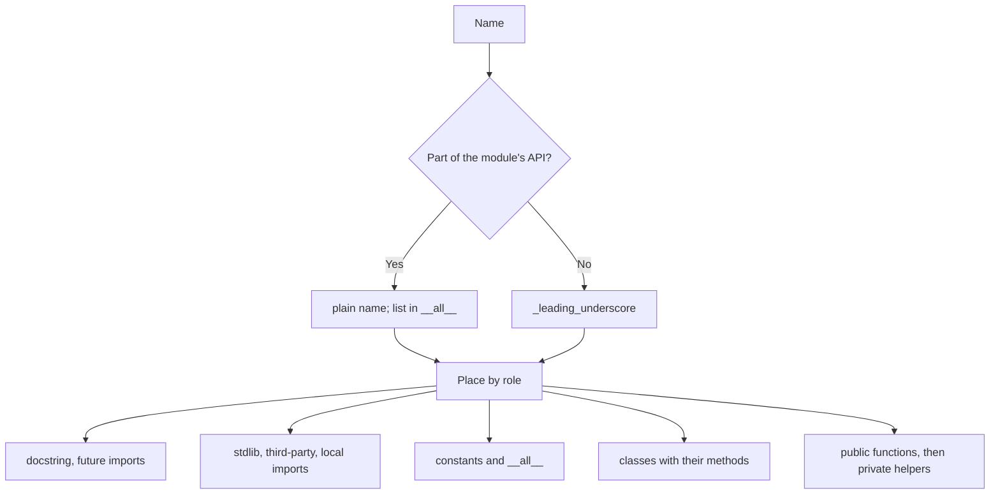

**Use when.** Any Python module. **Do not use when.** The package defines
its API through `__init__.py` re-exports: keep `__all__` there.

**Example.** From [`python/template.py`](../assets/layout/python/template.py):

```python
PUBLIC_CONSTANT = 1
_PRIVATE_CONSTANT = 2

__all__ = ["PUBLIC_CONSTANT", "PublicType", "public_function"]


@dataclass
class PublicType:
    state: int = _PRIVATE_CONSTANT

    def public_method(self) -> str:
        return self._render()

    def _render(self) -> str:
        return json.dumps({"state": self.state})


class _PrivateType:
    pass


def public_function() -> PublicType:
    return PublicType(state=_private_helper())


def _private_helper() -> int:
    return PUBLIC_CONSTANT
```

**Cost removed.** Accidental API: names without an underscore are
importable and can gain external callers.

**Verify.**

1. `ruff check --select I,F401` for import order and unused imports.
1. `python3 -c "import mod; print(mod.__all__)"` lists only intended names.

## Rust

**Definition.** Items are private to their module by default; `pub(super)`,
`pub(crate)`, and `pub` widen step by step
([Rust reference: visibility][rust-reference-visibility]).
Unit tests live in a `#[cfg(test)] mod tests` at the end of the file.

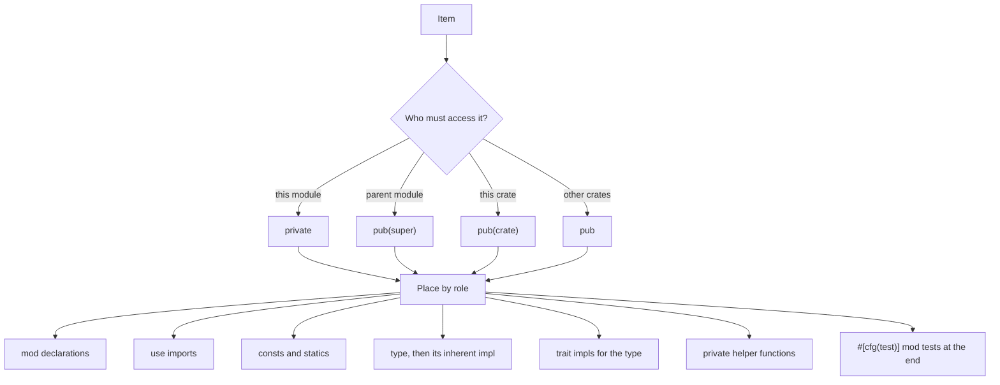

**Use when.** Any Rust module. **Do not use when.** A `pub` item belongs to
the crate's documented API: keep it.

**Example.** From [`rust/template.rs`](../assets/layout/rust/template.rs)
(compiled with `-D warnings` and its test run):

```rust
use std::fmt;

pub const PUBLIC_CONSTANT: usize = 1;
pub(crate) const CRATE_CONSTANT: usize = 2;
const PRIVATE_CONSTANT: usize = 4;

pub struct PublicType {
    field: usize,
}

impl PublicType {
    pub fn new() -> Self {
        Self {
            field: PRIVATE_CONSTANT,
        }
    }

    pub fn public_method(&self) -> usize {
        self.private_method() + CRATE_CONSTANT
    }

    pub(crate) fn crate_method(&self) -> usize {
        self.field
    }

    fn private_method(&self) -> usize {
        private_helper(self.field)
    }
}
```

**Cost removed.** `pub` items unreachable from outside the crate. The
allow-by-default lint `unreachable_pub` lists them. Measured: it reports
`unreachable pub item` and suggests `pub(crate)`.

**Verify.**

1. `cargo clippy -- -W unreachable_pub` (or
   `RUSTFLAGS='-W unreachable_pub' cargo check`) reports no new items in
   your diff.

## Go

**Definition.** Visibility is capitalization: identifiers starting with an
upper-case letter are exported from the package, all others are not
([Go spec: exported identifiers](https://go.dev/ref/spec#Exported_identifiers)).
Methods sit next to their receiver type.

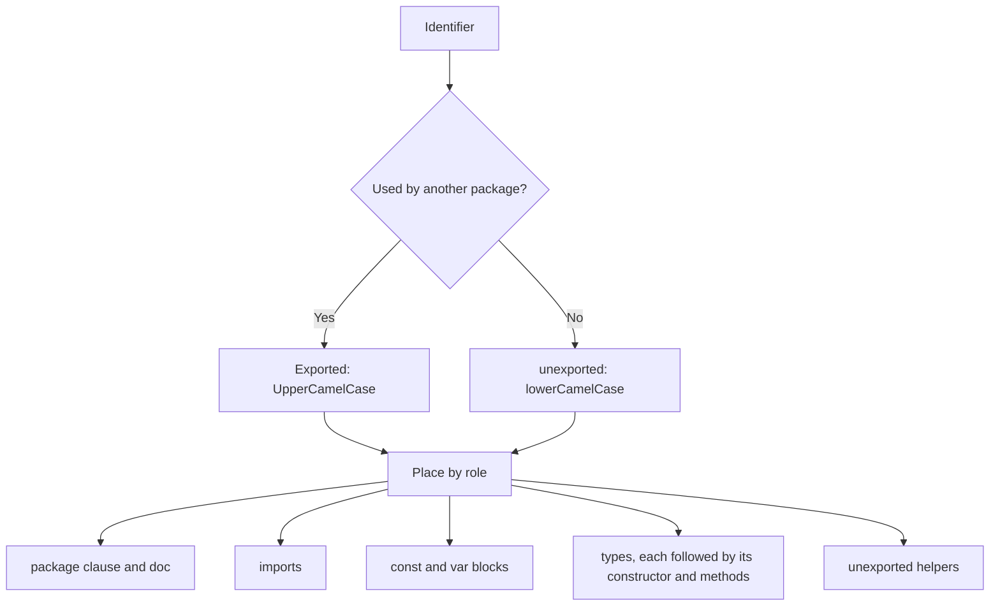

**Use when.** Any Go file. **Do not use when.** The code lives under
`internal/`, which already restricts importers
([internal packages](https://go.dev/doc/go1.4#internalpackages)); narrowing
exported names there still helps but matters less.

**Example.** From [`go/template.go`](../assets/layout/go/template.go) (checked
with `go vet`). Indentation is shown with spaces; the file uses tabs.

```go
const PublicConstant = 1
const privateConstant = 2

var PublicVariable = 1
var privateVariable = 2

type PublicType struct {
    PublicField  int
    privateField int
}

func NewPublicType() *PublicType {
    return &PublicType{}
}

func (p *PublicType) PublicMethod() {
}

func (p *PublicType) privateMethod() {
}

type privateType struct {
    value int
}

func privateHelper() {
    fmt.Print("")
}
```

**Cost removed.** Exported names that no other package uses.

**Verify.**

1. `go vet ./...` and `gofmt -l .` are clean.
1. For each new exported identifier, `rg -n '\bpkg\.Name\b' --glob '*.go'`
   finds a caller outside the package.

## C

**Definition.** Functions and file-scope objects have external linkage
unless declared `static`. Public declarations live in the header. The `.c`
file includes its own header first, which proves the header is
self-contained, and makes everything not declared there `static`.

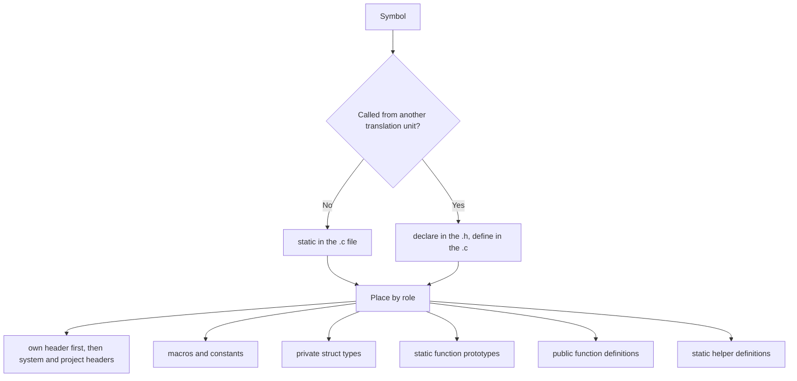

**Use when.** Any C translation unit. **Do not use when.** A test harness
needs a symbol: declare it in a separate internal header, not the public
one.

**Example.** From [`c/template.h`](../assets/layout/c/template.h):

```c
#define COMPONENT_PUBLIC_CONSTANT 1

struct component;

void component_public_function(void);
```

From [`c/template.c`](../assets/layout/c/template.c) (compiled with
`-Wall -Wextra -Werror`):

```c
#include "component.h" /* own header first proves it is self-contained */

#include <stddef.h>
#include <stdint.h>

#define LOCAL_MACRO 1

static const size_t LOCAL_CONSTANT = 64;

struct private_state {
  size_t value;
};

static void private_helper(struct private_state *state);

void component_public_function(void) {
  struct private_state state = {LOCAL_CONSTANT * LOCAL_MACRO};
  private_helper(&state);
}

static void private_helper(struct private_state *state) {
  state->value += COMPONENT_PUBLIC_CONSTANT;
}
```

**Cost removed.** Accidental external symbols (link-time name clashes,
unintended API). `-Wmissing-prototypes` reports non-`static` functions
without a prior declaration. Measured: clang prints `no previous prototype
for function 'helper'`.

**Verify.**

1. `cc -std=c17 -Wall -Wextra -Wmissing-prototypes -c file.c` has no
   warnings.
1. `nm -g file.o` lists only the symbols declared in the header.

## C++

**Definition.** The header declares the public API; the `.cpp` includes
its own header first; internal helpers go in an unnamed namespace, which
gives internal linkage. Class members run public, protected, private.

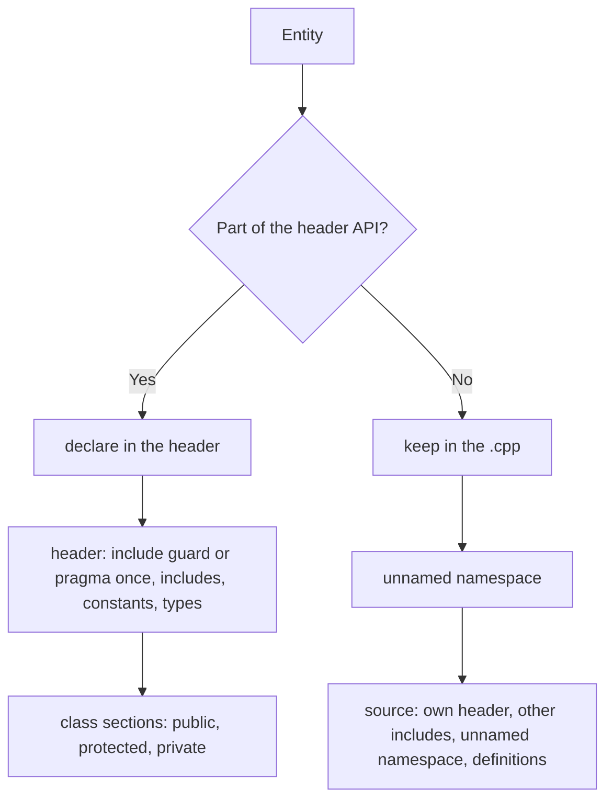

**Use when.** Any C++ component. **Do not use when.** The item is a
template, which must be defined in the header: keep it there.

**Example.** From [`cpp/template.hpp`](../assets/layout/cpp/template.hpp):

```cpp
namespace project {

inline constexpr std::size_t kPublicLimit = 128;

class PublicType {
public:
  PublicType();

  void public_method();

private:
  void private_method();
};
```

From [`cpp/template.cpp`](../assets/layout/cpp/template.cpp):

```cpp
#include "component.hpp" // own header first proves it is self-contained

#include <cstddef>

namespace project {

namespace {
constexpr std::size_t kPrivateLimit = 64;

std::size_t private_helper(std::size_t value) {
  return value < kPrivateLimit ? value : kPrivateLimit;
}
} // namespace
```

**Cost removed.** External linkage for internals. Measured: clang's
`-Wmissing-prototypes` also applies to C++.

**Verify.**

1. `c++ -std=c++20 -Wall -Wextra -Wmissing-prototypes -c file.cpp` is
   clean.

## C# and F#

**Definition.** C# members default to `private` and top-level types to
`internal`; `public` exposes outside the assembly
([C# access modifiers][c-access-modifiers]).
Use file-scoped namespaces. F# compiles files and declarations top to
bottom, so helpers come before their users; `internal`/`private` apply to
modules, types, and members.

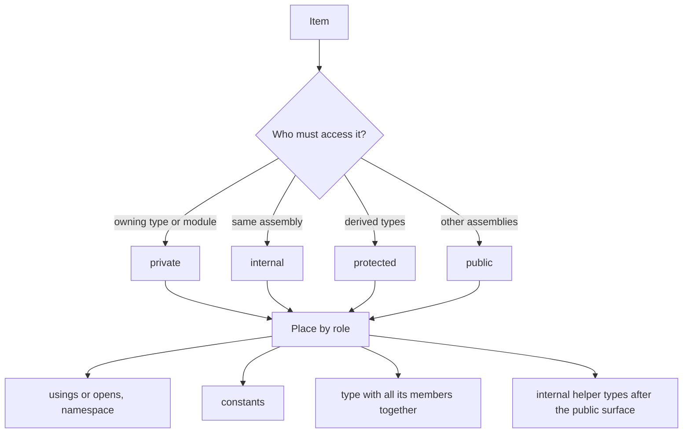

**Use when.** Any C# or F# file. **Do not use when.** A type is public API
of a published library: keep it public and mark the rest `internal`.

**Example.** Both templates build with the .NET 10 SDK, C# with warnings
as errors. From [`dotnet/template.cs`](../assets/layout/dotnet/template.cs):

```csharp
public sealed class PublicType
{
    private int state;

    public PublicType() => state = Constants.AssemblyValue;

    public int PublicMethod() => PrivateMethod() + Constants.PublicValue;

    internal int AssemblyMethod() => state;

    private int PrivateMethod() => InternalType.Helper(state);
}

// C# has no private top-level types; the narrowest top-level scope is
// internal (or file-local `file` types since C# 11).
internal static class InternalType
{
    internal static int Helper(int value) => Math.Abs(value);
}
```

From [`dotnet/template.fs`](../assets/layout/dotnet/template.fs), where the
internal helpers precede their users:

```fsharp
[<AutoOpen>]
module internal Internal =
    [<Literal>]
    let AssemblyConstant = 2

    let helper (value: int) = Math.Abs value

type PublicType() =
    member _.PublicMember() = helper AssemblyConstant
    member internal _.AssemblyMember() = AssemblyConstant
    member private _.PrivateMember() = ()

type internal InternalType() =
    member _.Run() = helper -1
```

**Cost removed.** Public types in applications. Analyzer [CA1515]
("Consider making public types internal") reports public types in
executable assemblies; .NET 10 does not enable it by default.

**Verify.**

1. Enable it for a check run (measured on .NET SDK 10.0.400 with an
   executable project):
   `dotnet build --no-incremental -p:AnalysisModeMaintainability=All
   -p:WarningsAsErrors=CA1515` reports `error CA1515` for each public type,
   or add `dotnet_diagnostic.CA1515.severity = warning` to
   `.editorconfig`.

## Java, Kotlin, Scala

**Definition.** Java: `private`, package-private (no modifier),
`protected`, `public`; one top-level public type per file named after it
([JLS 6.6][jls-6-6]).
Kotlin: `public` by default, plus `internal` (module) and `private` (file
or class) ([Kotlin visibility][kotlin-visibility]).
Scala: `public` by default, `private`, `protected`, and qualified
`private[pkg]` ([Scala access modifiers][scala-access-modifiers]).

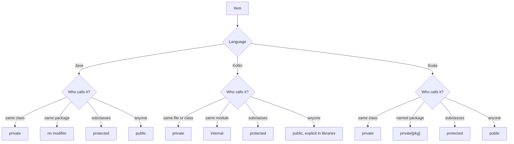

**Use when.** Any JVM source file. **Do not use when.** A framework needs
wider visibility (reflection-based injection, serialization): keep what it
needs and say why.

**Example.** The templates compile under `javac -Xlint:all -Werror`,
`kotlinc -Werror`, and `scala-cli compile`. From
[`jvm/template.java`](../assets/layout/jvm/template.java):

```java
public final class PublicType {
    public static final int PUBLIC_CONSTANT = 1;
    static final int PACKAGE_CONSTANT = 2;
    private static final int PRIVATE_CONSTANT = 3;

    public PublicType() {}

    public void publicMethod() {}

    void packageMethod() {}

    protected void protectedMethod() {}

    private void privateMethod() {}
```

From [`jvm/template.kt`](../assets/layout/jvm/template.kt):

```kotlin
const val PUBLIC_CONSTANT = 1
internal const val MODULE_CONSTANT = 2
private const val PRIVATE_CONSTANT = 3

open class PublicType {
    fun publicMethod(): Int = privateMethod() + MODULE_CONSTANT

    internal fun moduleMethod(): Int = PUBLIC_CONSTANT

    protected open fun protectedMethod(): Int = PRIVATE_CONSTANT

    private fun privateMethod(): Int = protectedMethod()
}
```

From [`jvm/template.scala`](../assets/layout/jvm/template.scala):

```scala
class PublicType:
  def publicMethod(): Unit = ()
  protected def protectedMethod(): Unit = ()
  private def privateMethod(): Unit = ()

private[component] class PackageScopedType
private[example] class WiderPackageScopedType
```

**Cost removed.** Kotlin's public-by-default surface: explicit API mode
(`-Xexplicit-api=strict`, or `explicitApi()` in Gradle) makes the compiler
require a visibility modifier on every public declaration in a library
([explicit API mode][explicit-api-mode]).

**Verify.**

1. Java: the public types in the diff are each used outside their package.
1. Kotlin libraries: compile with `-Xexplicit-api=strict`.

## JavaScript and TypeScript

**Definition.** A module's API is what it `export`s; everything else is
module-private. Class-private members use `#name`, which is private at run
time; TypeScript's `private` keyword is checked only at compile time
([MDN private properties][mdn-private-properties]).

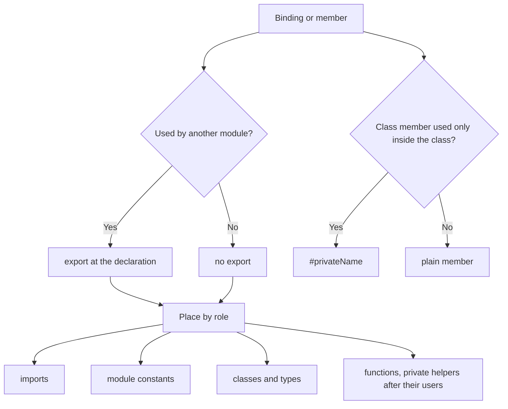

**Use when.** Any ES module. **Do not use when.** The codebase targets
runtimes without `#private` support: use closures or TypeScript `private`.

**Example.** Indentation is shown with spaces; both files use tabs. From
[`js-ts/template.ts`](../assets/layout/js-ts/template.ts) (`tsc --strict`):

```typescript
export const PUBLIC_CONSTANT = 1;
const PRIVATE_CONSTANT = 2;

export class PublicType {
    #state = 0;

    constructor() {}

    publicMethod(): void {}

    #privateMethod(): void {}
}

class PrivateType {
    #helper(): void {}
}

function privateHelper(): void {}

export function publicFunction(): void {}
```

From [`js-ts/template.js`](../assets/layout/js-ts/template.js)
(`node --check`), the same class without type annotations:

```javascript
export class PublicType {
    #state = 0;

    constructor() {}

    publicMethod() {}

    #privateMethod() {}
}
```

**Cost removed.** Exports with no importer.

**Verify.**

1. `tsc --noEmit --noUnusedLocals` flags unused non-exported bindings.
1. For each new `export`, `rg -n "from ['\"].*module-name['\"]"` finds an
   importer.

## Swift

**Definition.** Swift has `private` (enclosing declaration), `fileprivate`,
`internal` (default; module), `package`, `public`, and `open`
([Swift access control][swift-access-control]).

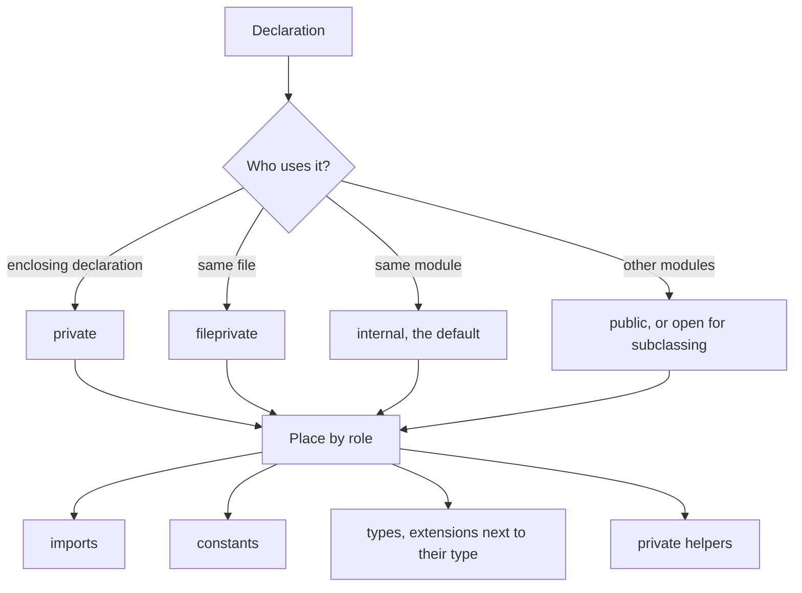

**Use when.** Any Swift file. **Do not use when.** Other modules must
subclass a library type: that requires `open`, not `public`.

**Example.** From
[`swift/template.swift`](../assets/layout/swift/template.swift) (type-checked
with `xcrun swiftc -typecheck`):

```swift
public let publicConstant = 1
internal let moduleConstant = 2
private let fileConstant = 3

public final class PublicType {
    public init() {}

    public func publicMethod() {}

    internal func moduleMethod() {}

    fileprivate func fileMethod() {}

    private func privateMethod() {}
}

private struct PrivateType {
    func helper() {}
}
```

**Cost removed.** Public API in libraries that no client needs.

**Verify.**

1. `swiftc -typecheck` (or `swift build`) is clean. On macOS, use
   `xcrun swiftc`: measured with a swiftly toolchain, `swiftc` fails with
   `unknown argument: '-target-arch-variant'`.

## Ruby

**Definition.** Methods are public by default; `protected` and `private`
apply to the methods defined after them; `private_constant` hides a
constant; `private_class_method` hides module-level helpers
([Ruby modules and classes][ruby-modules-and-classes]).

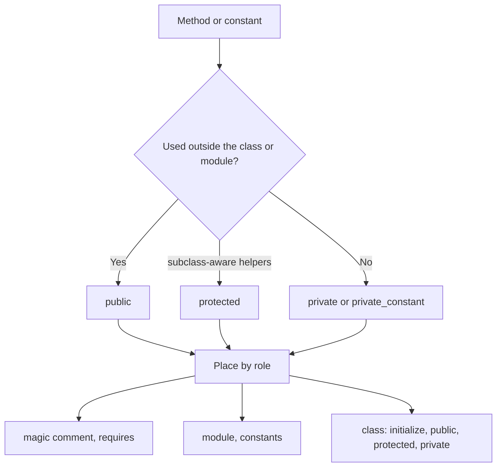

**Use when.** Any Ruby file. **Do not use when.** Metaprogramming needs
public methods (`send` with dynamic names): document why.

**Example.** From [`ruby/template.rb`](../assets/layout/ruby/template.rb)
(loaded and exercised with `ruby -w`):

```ruby
module Component
  PUBLIC_CONSTANT = 1
  PRIVATE_CONSTANT = 2
  private_constant :PRIVATE_CONSTANT

  class PublicType
    def initialize
      @state = PRIVATE_CONSTANT
    end

    def public_method
      JSON.generate(state: private_method)
    end

    protected

    def protected_method
      @state
    end

    private

    def private_method
      Component.send(:private_helper, protected_method)
    end
  end

  def self.private_helper(value)
    value * PUBLIC_CONSTANT
  end
  private_class_method :private_helper
end
```

**Cost removed.** Public methods that are implementation details.

**Verify.**

1. `ruby -wc file.rb` is clean, and a test shows that calling a private
   method from outside raises `NoMethodError`.

## Lua

**Definition.** Everything declared `local` is private to the chunk; the
module's API is the table it returns. A global is a mistake unless the host
requires it.

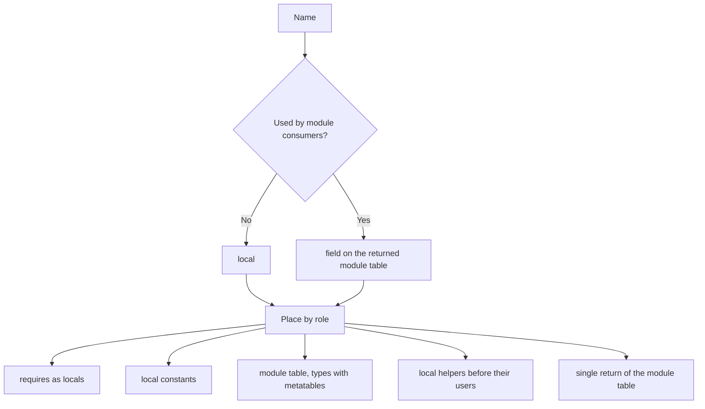

**Use when.** Any Lua module. **Do not use when.** The host application
uses globals as its API (for example, editor plugins): follow the host.

**Example.** From [`lua/template.lua`](../assets/layout/lua/template.lua)
(loaded and exercised with `lua`):

```lua
local string_format = string.format

local PRIVATE_CONSTANT = 1

local M = {}

M.PUBLIC_CONSTANT = 2

local PublicType = {}
PublicType.__index = PublicType

function PublicType.new(value)
    return setmetatable({ value = value or PRIVATE_CONSTANT }, PublicType)
end

function PublicType:describe()
    return string_format("PublicType(%d)", self.value)
end

local function private_helper(value)
    return value * M.PUBLIC_CONSTANT
end

function M.public_function(value)
    return PublicType.new(private_helper(value))
end

M.PublicType = PublicType

return M
```

**Cost removed.** Accidental globals.

**Verify.**

1. `luac -p file.lua` parses; `luacheck file.lua` (if installed) reports
   no global writes.

## Adding a language

**Definition.** A new language needs one skeleton file plus a card in this
reference with its decision graph.

**Use when.** The repository uses a language not listed here.

**Do not use when.** The language's community style guide already defines
an ordering: cite and follow it.

**Example.** Steps:

1. Take the language's visibility model from its reference.
1. Default to the narrowest visibility; widen only for a real caller.
1. Order by role; keep declarations next to their implementation.
1. Put tests where the ecosystem expects them.
1. Add `assets/layout/<language>/template.<ext>` and a check to
   `readable/verify.sh layout` that compiles or runs it.

For step 5, copy the Lua check in
[`verify.sh`](../assets/examples/readable/verify.sh): skip when the
toolchain is missing, otherwise load the template and assert one call.

```sh
    if have lua; then
        LUA_TEMPLATE="$L/lua/template.lua" lua -e '
            local m = dofile(os.getenv("LUA_TEMPLATE"))
            assert(m.public_function(3):describe() == "PublicType(6)")'
        pass lua
    else skip lua lua; fi
```

**Cost removed.** An agent inventing a new structure for each file.

**Verify.**

1. `sh assets/examples/readable/verify.sh layout` passes with the new check.

[rust-reference-visibility]: https://doc.rust-lang.org/reference/visibility-and-privacy.html
[c-access-modifiers]: https://learn.microsoft.com/en-us/dotnet/csharp/programming-guide/classes-and-structs/access-modifiers
[ca1515]: https://learn.microsoft.com/en-us/dotnet/fundamentals/code-analysis/quality-rules/ca1515
[jls-6-6]: https://docs.oracle.com/javase/specs/jls/se25/html/jls-6.html#jls-6.6
[kotlin-visibility]: https://kotlinlang.org/docs/visibility-modifiers.html
[scala-access-modifiers]: https://scala-lang.org/files/archive/spec/2.13/05-classes-and-objects.html#modifiers
[explicit-api-mode]: https://kotlinlang.org/docs/api-guidelines-simplicity.html#use-explicit-api-mode
[mdn-private-properties]: https://developer.mozilla.org/en-US/docs/Web/JavaScript/Reference/Classes/Private_properties
[swift-access-control]: https://docs.swift.org/swift-book/documentation/the-swift-programming-language/accesscontrol/
[ruby-modules-and-classes]: https://docs.ruby-lang.org/en/master/syntax/modules_and_classes_rdoc.html
